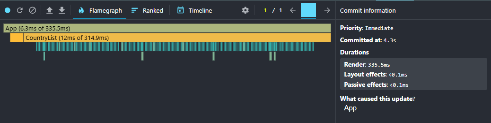
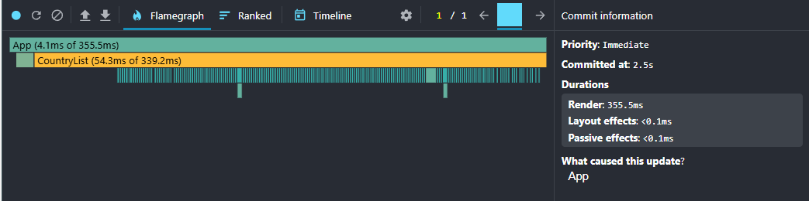
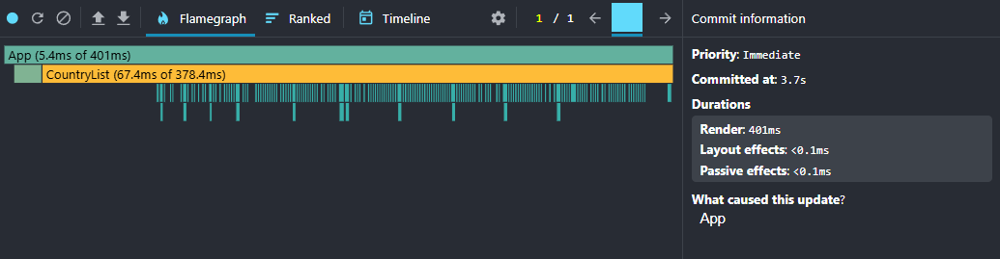
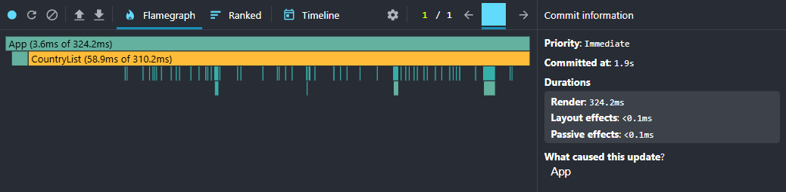

# Performance Optimization Report

## Baseline Measurements

### Interaction A: Sort countries

- **Commit duration**: 0.0355 s (или 35.5 ms)
- **Render duration**: 335.5 ms
- **Screenshot**: 

### Interaction B: Search countries

- **Commit duration**: 0.0041 s (или 4.1 ms)
- **Render duration**: 355.5 ms
- **Screenshot**: 

### Interaction C: Change year

- **Commit- **Commit duration**: 0.0054 s (или 5.4 ms)
- **Render duration**: 401 ms
- **Screenshot**: 

### Interaction D: Toggle column

- **Commit duration**: 0.0036 s (или 3.6 ms)
- **Render duration**: 324.2 ms
- **Screenshot**: 

## Optimized Measurements

### Interaction A: Sort countries

- **Commit duration**: ___ s
- **Render duration**: ___ ms
- **Screenshot**: 

### Interaction B: Search countries

- **Commit duration**: ___ s
- **Render duration**: ___ ms
- **Screenshot**: 

### Interaction C: Change year

- **Commit duration**: ___ s
- **Render duration**: ___ ms
- **Screenshot**: 

### Interaction D: Toggle column

- **Commit duration**: ___ s
- **Render duration**: ___ ms
- **Screenshot**: 

## Summary of Improvements

| Interaction | Baseline (ms) | Optimized (ms) | Improvement |
|-------------|---------------|----------------|--------------|
| Sort countries | ___ | ___ | ___% |
| Search countries | ___ | ___ | ___% |
| Change year | ___ | ___ | ___% |
| Toggle column | ___ | ___ | ___% |
| **Average** | **___** | **___** | **___%** |