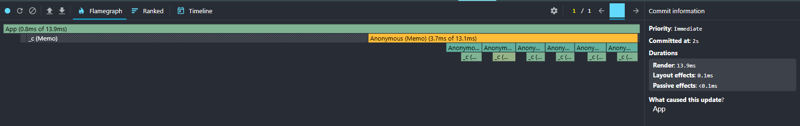
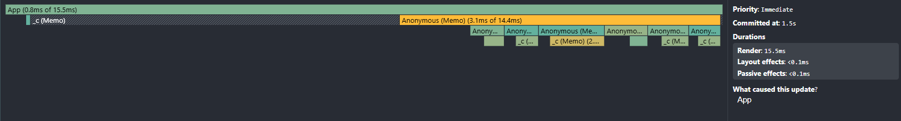
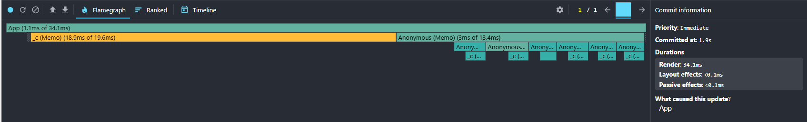
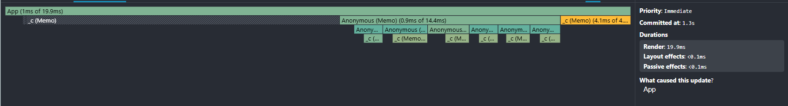

# Performance Optimization Report

## Baseline Measurements

### Interaction A: Sort countries

- **Commit duration**: 0.0355 s (или 35.5 ms)
- **Render duration**: 335.5 ms
- **Screenshot**: 

### Interaction B: Search countries

- **Commit duration**: 0.0041 s (или 4.1 ms)
- **Render duration**: 355.5 ms
- **Screenshot**: 

### Interaction C: Change year

- **Commit- **Commit duration\*\*: 0.0054 s (или 5.4 ms)
- **Render duration**: 401 ms
- **Screenshot**: 

### Interaction D: Toggle column

- **Commit duration**: 0.0036 s (или 3.6 ms)
- **Render duration**: 324.2 ms
- **Screenshot**: 

## Optimized Measurements

### Interaction A: Sort countries

- **Commit duration**: 0.0008 s (0.8 ms)
- **Render duration**: 13.9 ms
- **Screenshot**: 

### Interaction B: Search countries

- **Commit duration**: 0.0008 s (0.8 ms)
- **Render duration**: 15.5 ms
- **Screenshot**: 

### Interaction C: Change year

- **Commit duration**: 0.0011 s (1.1 ms)
- **Render duration**: 34.1 ms
- **Screenshot**: 

### Interaction D: Toggle column

- **Commit duration**: 0.0010 s (1.0 ms)
- **Render duration**: 19.9 ms
- **Screenshot**: 

## Summary of Improvements

| Interaction      | Baseline (ms) | Optimized (ms) | Improvement |
| ---------------- | ------------- | -------------- | ----------- |
| Sort countries   | 335.5         | 13.9           | 95.9%       |
| Search countries | 355.5         | 15.5           | 95.6%       |
| Change year      | 401           | 34.1           | 91.5%       |
| Toggle column    | 324.2         | 19.9           | 93.9%       |
| **Average**      | **354.05**    | **20.85**      | **94.1%**   |